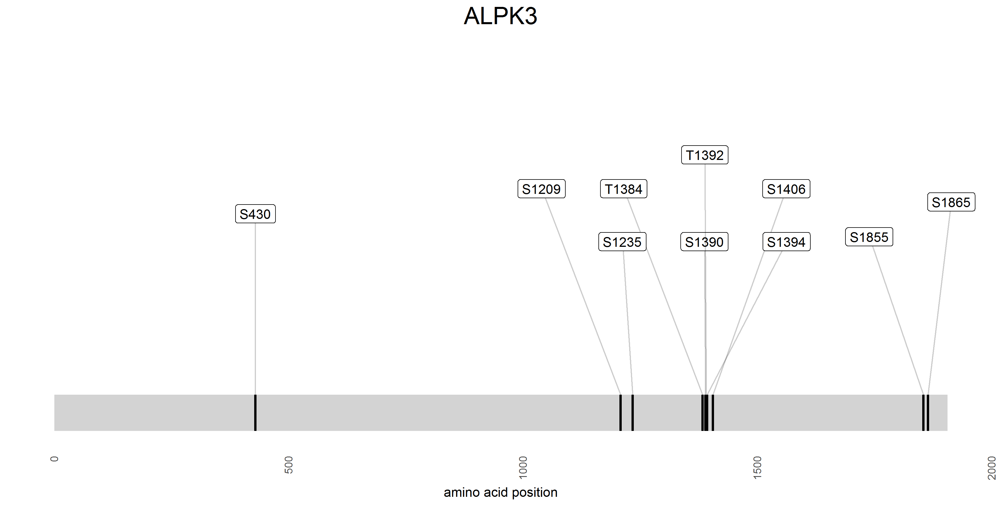
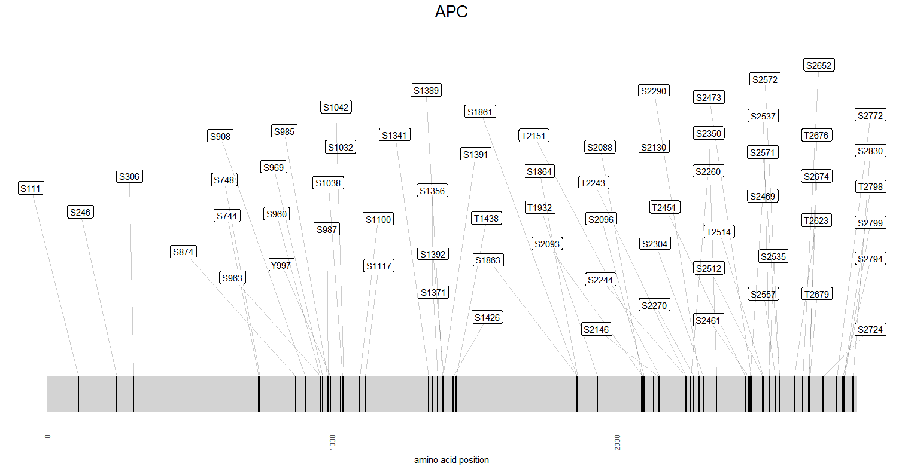

# Intro

This is one of typical tasks for dealing with proteomics data. It includes handling annotation, protein sequences and their visualization. Although you can use any of the packages that R offers, I suggest looking into [Bioconductor](http://www.bioconductor.org/) collection. Once you are done, please send back the R script(s) that does that job.

# Task steps

1. Read **phosphopeptides.txt.gz** file. There are two columns - one with protein RefSeq IDs, the other one with
peptide sequences. The [RefSeq](https://en.wikipedia.org/wiki/RefSeq) protein ID is fairly simple - it is "NP_" followed by a few digits. The format of a peptide sequence (e.g. R.S\*DPDPKAPANK.A) is as follows. The asterisk denotes the position of the phosphate group. The first and last letters separate by the dot are the flanking amino acids related to the peptide sequence context. That is they are part of the protein, but not part of the identified peptide.

2. Map RefSeq IDs to gene IDs. For example NP_000007 maps to ACADM, NP_000029 maps to APC gene.
Due to annotiation discrepancies for some RefSeq IDs there may not be a corresponding gene. Drop those from further consideration. After this step the table should look like 

| Gene   |  RefSeq |            Peptide |
|-------:|--------:|-------------------:|
| ACADM	|NP_000007|	  R.S\*DPDPKAPANK.A|
| APC    |NP_000029|	R.NSSSST\*S\*PVSK.K|

3. Map the position of phosphorylation. For that step you need the sequences of the proteins in the **H_sapiens_RefSeq.fasta.gz** file. For some genes there may be multiple RefSeq sequences. To resolve that ambiguity select the longest sequence per gene. Now having peptide sequences, gene IDs and corresponding protein sequences, please map the position of phosphorylation to the protein sequence. The mapped phosphorylation site should be the gene ID followed by dash, amino acid (S, T or Y) and amino acid position within the protein sequence. Here is the sample output:

| Gene   |  RefSeq |            Peptide |              Site |
|-------:|--------:|-------------------:|------------------:|
| ACADM	|NP_000007|	  R.S\*DPDPKAPANK.A|        ACADM-S207 |
| APC    |NP_000029|	R.NSSSST\*S\*PVSK.K|    APC-T2243S2244 |

Note, the **mapping part of the script shouldn't be taking more then 5 minutes**. Please make sure it is efficient.

4. Visualization step. The dataset covers 7131 genes. Please come up with some way of plotting positions of 
phosphosites for each gene. The example maps are shown below. Improved ways or visualizing phosphorylation positions are welcome.

